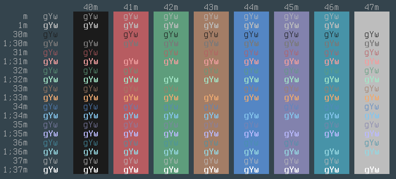

# Lonelydesktop
A colour scheme for Alacritty (or anything else with 16 ANSI colours).
Inspired by the Common Desktop Environment.

### Usage
Import the .toml into your Alacritty config. Or copy-paste the contents straight in. You do you.
